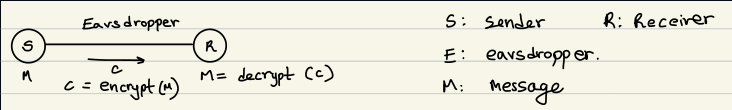

- TOC
{:toc}

# Lecture 1

## When is a problem an InfoSec one?

As Kannan said, when a problem is *impossible to solve*, perfectly. This includes both classical problems of information security (like hashing passwords, secure communication, and data integrity), but also non-typical problems from other fields like ???.

### Hashing Passwords

### Secure Communications

### Data Integrity

# Lecture 2

**Topics covered:**

- Kerckhoff's Principle
- Design and breaking of classical ciphers

Before starting the topics, consider the classical secure communications problem:

The goal 

# Lecture 3

**Topics Covered:**

- Shannon's Perfect Secrecy
- Vernam Cipher (one time pad) is perfect
- Limitations of Shannon's approach

## Definition of an Encryption Scheme

As a 4-tuple: <Gen, Enc, Dec, $$M$$>

